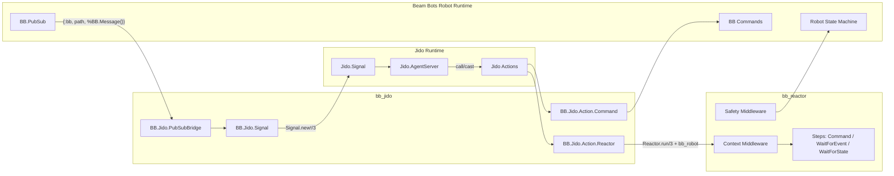

<!--
SPDX-FileCopyrightText: 2026 James Harton

SPDX-License-Identifier: Apache-2.0
-->

# Proposal: bb_jido

**Status:** Accepted
**Author:** James Harton
**Created:** 2026-01-20
**Updated:** 2026-03-29 — incorporated implementation analysis from @houllette
**Updated:** 2026-05-18 — aligned with Jido v2.2 (instance-scoped supervision, Skill→Plugin rename, removal of `actions:` on `use Jido.Agent`, removal of `handle_instruction`/`handle_signal` agent callbacks)
**Dependencies:** `bb_reactor` (optional, for workflow integration)

---

## Summary

`bb_jido` integrates the [Jido](https://github.com/agentjido/jido) autonomous agent framework with Beam Bots, enabling robots to make goal-directed decisions rather than just execute pre-defined sequences. Where `bb_reactor` answers "how do I execute this workflow?", Jido agents answer "what should I do next to achieve this goal?"

---

## Motivation

### The Limits of Explicit Workflows

`bb_reactor` excels at structured task sequences—pick-and-place, calibration, assembly. You declare the steps, dependencies, and compensation logic. The reactor executes them.

But some scenarios resist pre-declaration:

| Scenario | Why Reactors Are Awkward |
|----------|--------------------------|
| "Pick up the red block" | Need to locate, select grasp strategy, plan approach—decisions depend on perception |
| Multi-robot coordination | Robots must negotiate tasks dynamically, not follow fixed scripts |
| Recovery from unexpected states | When assumptions fail, you need adaptive replanning, not just compensation |
| Human-robot collaboration | Human actions are unpredictable; robot must adapt in real-time |
| Voice/LLM-directed tasks | Natural language goals decompose differently based on context |

These require a higher-level abstraction: **goal-directed agents that decide what to do**.

### Why Jido?

[Jido](https://agentjido.xyz/) (自動 - "automatic") is an Elixir framework for autonomous agent systems. Key properties:

1. **Event-driven, not tick-based** — Like `bb_reactor`, Jido uses signals and message passing. No polling loops. This aligns with our critique of behaviour trees.

2. **Pure agent logic** — Agents are immutable data structures. Side effects are described as directives, executed by a runtime. This matches Elixir idioms.

3. **Composable actions** — Actions are validated, introspectable units of work. Similar to reactor steps but designed for dynamic selection.

4. **AI-optional** — Core has zero LLM code. `jido_ai` is separate. You can use classical planning, decision trees, or LLMs—it's agnostic.

5. **Production-ready** — Built on OTP patterns, with supervision, fault tolerance, and telemetry.

### The Layered Architecture

Jido doesn't replace `bb_reactor`—it sits above it:

```
┌─────────────────────────────────────────────────┐
│  Jido Agent                                     │
│  "Achieve goal: assemble widget"                │
│  - Observes world state via BB sensors          │
│  - Selects strategy based on context            │
│  - Invokes workflows or commands                │
├─────────────────────────────────────────────────┤
│  bb_reactor Workflows                           │
│  PickAndPlace, Calibrate, ReturnHome            │
│  - Structured sequences with compensation       │
│  - Compile-time validated                       │
├─────────────────────────────────────────────────┤
│  BB Commands                                    │
│  move_to_pose, close_gripper, home              │
│  - Direct robot control                         │
└─────────────────────────────────────────────────┘
```

The agent decides "I need to pick up part A", then invokes `PickAndPlace` reactor with appropriate inputs. If perception reveals the part isn't where expected, the agent adapts—perhaps searching, or asking for help.

### Why a Separate Package?

1. **Not everyone needs agents** — Many robots work fine with explicit workflows
2. **Additional dependency** — Jido adds weight some projects don't need
3. **Can evolve independently** — Agent patterns are still emerging
4. **Clear integration boundary** — BB provides robotics primitives; Jido provides agent orchestration

---

## Design

### Core Integration: BB.Jido.Action

Wrap BB functionality as Jido Actions:

```elixir
defmodule BB.Jido.Action.Command do
  @moduledoc """
  Jido Action that executes a BB command.

  Bridges Jido's action system to BB's command infrastructure.
  """

  use Jido.Action,
    name: "bb_command",
    description: "Execute a Beam Bots command",
    schema: [
      robot: [type: :atom, required: true, doc: "Robot module"],
      command: [type: :atom, required: true, doc: "Command name"],
      goal: [type: :map, default: %{}, doc: "Command arguments"],
      timeout: [type: :integer, default: 30_000, doc: "Command timeout in ms"]
    ]

  @impl Jido.Action
  def run(%{robot: robot, command: command, goal: goal} = params, _context) do
    timeout = Map.get(params, :timeout, 30_000)

    case apply(robot, command, [goal]) do
      {:ok, pid} ->
        case BB.Command.await(pid, timeout) do
          {:ok, result} ->
            {:ok, %{status: :completed, result: result}}

          {:error, :disarmed} ->
            {:error, :safety_disarmed}

          {:error, reason} ->
            {:error, {:command_failed, reason}}
        end

      {:error, reason} ->
        {:error, reason}
    end
  end
end
```

### Reactor as Action

Run entire reactor workflows as single Jido actions:

```elixir
defmodule BB.Jido.Action.Reactor do
  @moduledoc """
  Jido Action that runs a BB.Reactor workflow.

  Enables agents to invoke structured workflows as atomic operations.
  """

  use Jido.Action,
    name: "bb_reactor",
    description: "Execute a Beam Bots reactor workflow",
    schema: [
      robot: [type: :atom, required: true],
      reactor: [type: :atom, required: true, doc: "Reactor module"],
      inputs: [type: :map, default: %{}, doc: "Reactor inputs"]
    ]

  @impl Jido.Action
  def run(%{robot: robot, reactor: reactor, inputs: inputs}, _context) do
    context = %{private: %{bb_robot: robot}}

    case Reactor.run(reactor, inputs, context) do
      {:ok, result} ->
        {:ok, %{reactor: reactor, result: result}}

      {:error, errors} ->
        {:error, {:reactor_failed, errors}}

      {:halt, reason} ->
        {:error, {:reactor_halted, reason}}
    end
  end
end
```

### PubSub Bridge

Bridge BB's PubSub events to Jido signals. Beam Bots PubSub delivers `{:bb, source_path, %BB.Message{}}` to subscribers. The bridge converts these to Jido signals and forwards them into the agent via `Jido.AgentServer.cast/2`.

> **Note:** The original proposal modelled this as a Jido Sensor. Jido v2's sensor runtime (`Jido.Sensor.Runtime`) expects events injected via `Jido.Sensor.Runtime.event/2`, which adds unnecessary indirection for PubSub messages that are already delivered as Erlang messages. A direct GenServer bridge is simpler for v0.1; a Jido Sensor wrapper can be added later if desired.

```elixir
defmodule BB.Jido.PubSubBridge do
  @moduledoc """
  GenServer that bridges BB.PubSub events to Jido signals.

  Subscribes to configured BB.PubSub topics and forwards them
  as Jido signals to an AgentServer, with optional filtering
  and throttling for high-volume topics.
  """

  use GenServer

  def start_link(opts) do
    GenServer.start_link(__MODULE__, opts)
  end

  @impl GenServer
  def init(opts) do
    robot = Keyword.fetch!(opts, :robot)
    agent_pid = Keyword.fetch!(opts, :agent_pid)
    topics = Keyword.fetch!(opts, :topics)

    for topic <- topics do
      BB.PubSub.subscribe(robot, topic)
    end

    {:ok, %{robot: robot, agent_pid: agent_pid, topics: topics}}
  end

  @impl GenServer
  def handle_info({:bb, path, %BB.Message{} = message}, state) do
    signal = BB.Jido.Signal.from_pubsub(state.robot, path, message)
    Jido.AgentServer.cast(state.agent_pid, signal)
    {:noreply, state}
  end
end
```

Signal mapping follows CloudEvents conventions used by Jido:

```elixir
defmodule BB.Jido.Signal do
  @moduledoc """
  Canonical mapping from BB.PubSub messages to Jido signals.
  """

  def from_pubsub(robot, path, %BB.Message{} = message) do
    Jido.Signal.new!(
      "bb.pubsub.#{Enum.join(path, ".")}",
      %{
        robot: robot,
        path: path,
        message: message
      },
      source: "/bb/#{inspect(robot)}"
    )
  end
end
```

### Robot Plugin

Jido v2.0 removed the `actions:` option from `use Jido.Agent`. Agent capabilities are now declared inside **Plugins** (the v2 rename of "Skills") that are attached via `plugins:`. We therefore expose robot integration as a plugin rather than an agent macro:

```elixir
defmodule BB.Jido.Plugin.Robot do
  @moduledoc """
  Jido Plugin that gives an agent the ability to control a Beam Bots robot.

  Provides:
  - Standard robot actions (Command, Reactor, WaitForState, GetJointState)
  - Robot-related state (safety_state, last_joint_state)
  - Default signal routes for `bb.*` signal types
  - Automatic PubSubBridge startup (mounted under the agent's pid)
  """

  use Jido.Plugin,
    name: "bb_robot",
    state_key: :robot,
    actions: [
      BB.Jido.Action.Command,
      BB.Jido.Action.Reactor,
      BB.Jido.Action.WaitForState,
      BB.Jido.Action.GetJointState
    ],
    schema: [
      robot: [type: :atom, required: true],
      safety_state: [type: :atom, default: :unknown],
      last_joint_state: [type: :map, default: %{}]
    ],
    signal_routes: [
      {"bb.command.execute", BB.Jido.Action.Command},
      {"bb.reactor.run", BB.Jido.Action.Reactor},
      {"bb.state.wait", BB.Jido.Action.WaitForState}
    ]

  @impl Jido.Plugin
  def mount(agent, %{robot: robot} = config) do
    {:ok, bridge} =
      BB.Jido.PubSubBridge.start_link(
        robot: robot,
        agent_pid: self(),
        topics: Map.get(config, :topics, default_topics())
      )

    {:ok, %{robot: robot, bridge: bridge, safety_state: :unknown}}
  end

  @impl Jido.Plugin
  def handle_signal(%Jido.Signal{type: "bb.state.transition"} = sig, agent) do
    # Pre-routing hook: cache safety state so blocking waits become rare.
    {:ok, put_in(agent.state.robot.safety_state, sig.data.message.payload.to)}
  end

  def handle_signal(_signal, agent), do: {:ok, agent}

  defp default_topics, do: [[:state_machine], [:safety]]
end
```

Users attach the plugin to a vanilla `Jido.Agent`:

```elixir
defmodule MyRobot.Agent do
  use Jido.Agent,
    name: "my_robot",
    plugins: [{BB.Jido.Plugin.Robot, %{robot: MyRobot}}]
end
```

### Example: Pick and Place Agent

In v2.2, the agent itself stays declarative — orchestration logic lives in an action that emits directives chaining to the next step:

```elixir
defmodule MyRobot.Plugin.Manipulator do
  @moduledoc """
  Plugin that performs manipulation tasks.

  Given a goal like "pick up the red block":
  1. Locate the object via perception
  2. Select a grasp strategy
  3. Run the PickAndPlace reactor
  4. Verify success or emit a recovery signal
  """

  use Jido.Plugin,
    name: "manipulator",
    state_key: :manipulator,
    actions: [
      MyRobot.Actions.LocateObject,
      MyRobot.Actions.SelectGrasp,
      MyRobot.Actions.VerifyGrip,
      MyRobot.Actions.PickObject
    ],
    signal_routes: [
      {"manipulator.pick", MyRobot.Actions.PickObject}
    ]
end

defmodule MyRobot.Actions.PickObject do
  use Jido.Action,
    name: "pick_object",
    schema: [target: [type: :atom, required: true]]

  alias Jido.Directive.Emit

  def run(%{target: target}, %{agent: agent}) do
    robot = agent.state.robot.robot

    with {:ok, %{location: location}} <-
           MyRobot.Actions.LocateObject.run(%{target: target}, %{}),
         {:ok, %{grasp: grasp}} <-
           MyRobot.Actions.SelectGrasp.run(
             %{target: target, location: location},
             %{}
           ),
         {:ok, _} <-
           BB.Jido.Action.Reactor.run(
             %{
               robot: robot,
               reactor: MyRobot.Reactor.PickAndPlace,
               inputs: %{pick_pose: location, grasp_strategy: grasp}
             },
             %{}
           ),
         {:ok, _} <- MyRobot.Actions.VerifyGrip.run(%{}, %{}) do
      {:ok, %{target: target},
       [%Emit{signal: Jido.Signal.new!("object.picked", %{target: target})}]}
    else
      {:error, :object_not_found} ->
        {:ok, %{target: target, recovered: false},
         [%Emit{signal: Jido.Signal.new!("object.not_found", %{target: target})}]}

      {:error, reason} ->
        {:error, reason}
    end
  end
end
```

The agent dispatches the work by emitting a signal:

```elixir
:ok =
  Jido.AgentServer.cast(
    pid,
    Jido.Signal.new!("manipulator.pick", %{target: :red_block})
  )
```

### Multi-Robot Coordination

Jido signals enable robot-to-robot coordination. In v2.2 the agent stays empty and the routing/handling lives in a plugin:

```elixir
defmodule MyFleet.Plugin.Coordinator do
  @moduledoc """
  Plugin that coordinates multiple robots.

  Receives task-completion signals, allocates next tasks, surfaces errors.
  """

  use Jido.Plugin,
    name: "fleet_coordinator",
    state_key: :fleet,
    actions: [
      MyFleet.Actions.AllocateTask,
      MyFleet.Actions.HandleRobotError
    ],
    schema: [
      pending: [type: {:map, :atom, :map}, default: %{}],
      assignments: [type: {:map, :atom, :atom}, default: %{}]
    ],
    signal_routes: [
      {"robot.task.completed", MyFleet.Actions.AllocateTask},
      {"robot.error", MyFleet.Actions.HandleRobotError}
    ]

  # Pre-routing hook: maintain bookkeeping before the routed action runs.
  @impl Jido.Plugin
  def handle_signal(%Jido.Signal{type: "robot.task.completed"} = sig, agent) do
    %{robot_id: robot_id, task_id: task_id} = sig.data
    {:ok, mark_completed(agent, robot_id, task_id)}
  end

  def handle_signal(_signal, agent), do: {:ok, agent}
end

defmodule MyFleet.Agent do
  use Jido.Agent,
    name: "fleet_coordinator",
    plugins: [MyFleet.Plugin.Coordinator]
end
```

`MyFleet.Actions.AllocateTask` is a regular `Jido.Action` that returns `{:ok, result, [%Jido.Directive.Emit{…}]}` to emit `robot.task.assigned` for the chosen robot.

### Safety Integration

Agents must respect the BB safety system:

```elixir
defmodule BB.Jido.Action.SafetyAware do
  @moduledoc """
  Mixin for actions that should check safety state.
  """

  defmacro __using__(_opts) do
    quote do
      @before_compile BB.Jido.Action.SafetyAware
    end
  end

  defmacro __before_compile__(_env) do
    quote do
      defoverridable run: 2

      def run(params, context) do
        robot = Map.get(params, :robot) || Map.get(context, :robot)

        case BB.Safety.state(robot) do
          :armed ->
            super(params, context)

          state when state in [:disarmed, :error] ->
            {:error, {:safety_not_armed, state}}
        end
      end
    end
  end
end
```

---

## Package Structure

```
bb_jido/
├── lib/
│   └── bb/
│       └── jido/
│           ├── action/
│           │   ├── command.ex         # BB.Command wrapper
│           │   ├── reactor.ex         # BB.Reactor wrapper
│           │   ├── wait_for_state.ex  # Wait for robot state
│           │   ├── get_joint_state.ex # Read joint positions
│           │   └── safety_aware.ex    # Safety checking mixin
│           ├── plugin/
│           │   └── robot.ex           # BB.Jido.Plugin.Robot
│           ├── pubsub_bridge.ex       # BB.PubSub → Jido signal bridge (GenServer)
│           ├── signal.ex              # Canonical signal mapping
│           └── telemetry.ex           # Telemetry events
├── test/
├── mix.exs
├── README.md
└── CHANGELOG.md
```

### Dependencies

```elixir
# mix.exs
defp deps do
  [
    {:bb, "~> 0.13"},
    {:jido, "~> 2.2"},
    # Optional: for AI-driven planning
    {:jido_ai, "~> 2.1", optional: true}
  ]
end
```

Jido v2.0 requires Elixir `~> 1.18`. `jido_action` and `jido_signal` are pulled in transitively by `jido`; pin them directly only if `bb_jido` needs a newer point release than `jido`'s current range allows.

---

## User Experience

### Simple Agent

```elixir
defmodule MyRobot.Agent do
  use Jido.Agent,
    name: "my_robot",
    plugins: [{BB.Jido.Plugin.Robot, %{robot: MyRobot}}]
end

# Start under your Jido instance and send it a signal:
{:ok, pid} = Jido.start_agent(MyApp.Jido, MyRobot.Agent)

:ok =
  Jido.AgentServer.cast(
    pid,
    Jido.Signal.new!(
      "bb.command.execute",
      %{robot: MyRobot, command: :home, goal: %{}}
    )
  )
```

### With AI Planning (jido_ai)

`jido_ai` v2 exposes planning as plain Jido Actions (`Jido.AI.Actions.Planning.Plan`, `.Decompose`, `.Prioritize`) rather than a top-level `Jido.AI.plan/2` function. You attach them like any other action:

```elixir
defmodule MyRobot.PlannerPlugin do
  use Jido.Plugin,
    name: "planner",
    state_key: :planner,
    actions: [Jido.AI.Actions.Planning.Plan],
    signal_routes: [
      {"robot.goal.natural_language", Jido.AI.Actions.Planning.Plan}
    ]
end

defmodule MyRobot.SmartAgent do
  use Jido.Agent,
    name: "smart_robot",
    plugins: [
      {BB.Jido.Plugin.Robot, %{robot: MyRobot}},
      MyRobot.PlannerPlugin
    ]
end

:ok =
  Jido.AgentServer.cast(
    pid,
    Jido.Signal.new!("robot.goal.natural_language", %{
      goal: "Pick up the red block and place it in the bin"
    })
  )
```

The planner action's directives chain into `bb.reactor.run` / `bb.command.execute` signals handled by `BB.Jido.Plugin.Robot`.

### Supervised in Application

Jido v2 requires an instance-scoped supervisor. Each app declares its own:

```elixir
defmodule MyApp.Jido do
  use Jido, otp_app: :my_app
end

defmodule MyApp.Application do
  use Application

  def start(_type, _args) do
    children = [
      MyRobot,
      {Jido, name: MyApp.Jido}
    ]

    Supervisor.start_link(children, strategy: :one_for_one)
  end
end

# Then, after boot:
{:ok, _pid} = Jido.start_agent(MyApp.Jido, MyRobot.Agent, id: "main")
```

---

## Acceptance Criteria

### Must Have

- [ ] `BB.Jido.Action.Command` - Execute BB commands as Jido actions
- [ ] `BB.Jido.Action.Reactor` - Run BB.Reactor workflows as Jido actions
- [ ] `BB.Jido.PubSubBridge` + `BB.Jido.Signal` - Bridge BB.PubSub events to Jido signals
- [ ] `BB.Jido.Plugin.Robot` - Jido v2 plugin that owns robot state, default actions, and default signal routes; mounts the PubSubBridge
- [ ] Safety integration - Actions respect BB.Safety state
- [ ] Documentation with examples
- [ ] Tests for action execution and signal bridging

### Should Have

- [ ] `BB.Jido.Action.WaitForState` - Wait for robot state machine transition
- [ ] `BB.Jido.Action.GetJointState` - Read current joint positions
- [ ] `BB.Jido.Action.SafetyAware` - Mixin for safety-checking actions
- [ ] Example: simple agent controlling simulated robot
- [ ] Telemetry integration

### Won't Have

- [ ] LLM/AI integration (use `jido_ai` directly)
- [ ] Perception/vision (separate concern)
- [ ] Multi-robot discovery (application-level concern)
- [ ] Custom Jido action implementations beyond BB wrappers

---

## Implementation Analysis

> _This section captures findings from @houllette's implementation analysis ([PR #11 comment](https://github.com/beam-bots/proposals/pull/11#issuecomment-4121730106)). It identifies API mismatches in the original proposal, recommends concrete architecture decisions, and provides a task breakdown._

### API Corrections from Original Proposal

The original proposal's code sketches were written against an older Jido API and an incorrect PubSub message format. The 2026-05-18 revision additionally aligns with Jido v2.0–v2.2 (Skill→Plugin rename, instance-scoped supervision, removal of `actions:` on `use Jido.Agent`, removal of `handle_instruction`/`handle_signal` agent callbacks).

| Issue | Original (incorrect) | Corrected |
|-------|---------------------|-----------|
| **Jido version** | `{:jido, "~> 1.2"}` | `{:jido, "~> 2.2"}` — v2.0 instance-scoped supervisors, v2.1 durable scheduler, v2.2 pod architecture |
| **PubSub message shape** | `{:bb_pubsub, path, message}` | `{:bb, source_path, %BB.Message{}}` — the actual subscriber delivery format |
| **Command waiting** | Raw `Process.monitor` + `receive` | `BB.Command.await/2` with ResultCache fallback — matches `bb_reactor` Step.Command semantics |
| **Sensor approach** | `use Jido.Sensor` with `mount/1` + `handle_info/2` | `PubSubBridge` GenServer — adds no benefit to wrap PubSub messages already delivered as Erlang messages |
| **Agent actions** | `use Jido.Agent, actions: [...]` | `use Jido.Agent, plugins: [{BB.Jido.Plugin.Robot, %{robot: MyRobot}}]` — v2 removed the `actions:` option on agents; actions live inside plugins |
| **Instruction dispatch** | `def handle_instruction(...)` / `Jido.Agent.instruct/2` / `Jido.Agent.run_action/3` | `signal_routes:` map signal types → actions; emit `Jido.Signal` via `AgentServer.cast/2`; agents use `cmd/2` as a pure function |
| **Signal handling** | `def handle_signal(%Jido.Signal{...}, agent)` on the agent | `Jido.Plugin.handle_signal/2` pre-routing hook; agents themselves stay declarative |
| **Application supervision** | `{MyRobot.Agent, robot: MyRobot}` directly in the supervision tree | `{Jido, name: MyApp.Jido}` plus `Jido.start_agent(MyApp.Jido, MyRobot.Agent, ...)` |
| **AI planning** | `Jido.AI.plan(agent, text)` | `Jido.AI.Actions.Planning.Plan` is a regular action; chain via signal routes |
| **Skills / Plugins** | "Skill" terminology | Renamed to **Plugin** in v2.0-rc.3 |
| **Built-in action namespace** | `Jido.Actions.*` | `Jido.Tools.*` |

### Architecture

Jido v2 forces plugins to v0.1 (you can no longer attach actions directly to an agent). The recommended approach is therefore:

- **v0.1 (thin wrappers + robot plugin):** `BB.Jido.Action.*` modules call BB and `bb_reactor` directly. `BB.Jido.Plugin.Robot` owns robot-related agent state (safety state, last joint state), default `bb.*` signal routes, and mounts the `PubSubBridge` for its agent.
- **v0.2+:** Specialised sub-plugins (manipulator, navigation, perception) attach alongside `BB.Jido.Plugin.Robot` to add domain-specific actions and routes.



### Interface Mapping

| Jido concept | BB / `bb_reactor` concept | Bridge surface | Notes |
|---|---|---|---|
| Action execution (`run/2`) | Robot commands or reactor workflows | `BB.Jido.Action.Command`, `BB.Jido.Action.Reactor` | Actions use `BB.Command.await/2` and `Reactor.run/3` respectively |
| Signals | PubSub events, state changes | `BB.Jido.PubSubBridge` + `BB.Jido.Signal` | Maps `{:bb, path, %BB.Message{}}` to `Jido.Signal` with CloudEvents naming |
| Waiting for events | `BB.Reactor.Step.WaitForEvent` semantics | Optional `BB.Jido.Action.WaitForEvent` | Blocking waits inside AgentServer need care; consider async strategy |
| Robot operational state | `Runtime.state(robot)`, PubSub `[:state_machine]` | `BB.Jido.Action.WaitForState` | Store last-known state in agent state to reduce blocking waits |
| Workflow orchestration | Reactor + context middleware | `BB.Jido.Action.Reactor` | `Reactor.run(mod, inputs, %{private: %{bb_robot: robot}})` |
| Safety | Command exit `:disarmed`; reactor error reporting | Safety-aware action wrappers | Consistent error taxonomy: `:safety_disarmed`, `{:command_failed, reason}`, etc. |

### Error Taxonomy

A consistent set of tagged errors aligned with upstream patterns:

- `{:error, {:command_failed, reason}}` — command await failures
- `{:error, {:reactor_failed, errors}}` — reactor execution errors
- `{:error, {:reactor_halted, reason}}` — reactor halted (e.g. safety)
- `{:error, :safety_disarmed}` — command exited with disarm semantics

### Signal Naming Conventions

Signals follow a `bb.` namespace with stable, queryable type strings:

- `bb.pubsub.<path>` — generic PubSub envelope (e.g. `bb.pubsub.sensor.joint_state`)
- `bb.state.transition` — robot state machine transitions (specialised)
- `bb.sensor.joint_state` — joint state updates (specialised)

Source follows `/bb/<robot_module>` convention for traceability.

### High-Volume Signal Filtering

BB.PubSub can deliver joint states at 100Hz. Mitigations for v0.1:

1. **Topic allowlist** — only subscribe to explicitly configured paths
2. **Message-type filtering** — use `message_types:` option at subscription time where possible
3. **Throttling/sampling** — optional "emit joint_state at most every N ms" in PubSubBridge
4. **Backpressure** — if agent mailbox grows, drop or coalesce "latest value" signals rather than emitting everything

### Implementation Tasks

Estimates assume one experienced Elixir developer, excluding review/iteration.

| Priority | Task | Effort | Dependencies |
|---|---|---:|---|
| P0 | Mix project scaffolding, CI skeleton | 4–6h | — |
| P0 | `BB.Jido.Action.Command` using `BB.Command.await/2` | 8–12h | BB command API |
| P0 | `BB.Jido.Action.Reactor` using `Reactor.run/3` | 6–10h | `bb_reactor` context contract |
| P0 | `BB.Jido.Signal` mapping helper + canonical naming | 6–10h | PubSub format + Jido Signal |
| P0 | `BB.Jido.PubSubBridge` GenServer with filtering | 10–16h | PubSub subscribe semantics |
| P0 | `BB.Jido.Plugin.Robot` plugin (state + default routes + bridge mount) | 8–12h | Jido v2 plugin DSL |
| P0 | README + 2 complete examples (command + reactor) | 6–10h | Core actions |
| P1 | `BB.Jido.Action.WaitForState` | 6–10h | `Runtime.state` + PubSub `[:state_machine]` |
| P1 | Telemetry hooks | 6–10h | — |
| P1 | Example simulated robot scenario for CI | 8–14h | BB simulation patterns |
| P2 | `BB.Jido.Action.WaitForEvent` | 6–10h | WaitForEvent semantics |

### Testing Strategy

**Unit tests (fast, deterministic):**
- `BB.Jido.Signal` mapping: path → signal.type transformations, data embedding, unknown payload handling
- `BB.Jido.Action.Command`: success/failure/timeout paths via `BB.Command.await/2`
- `BB.Jido.Action.Reactor`: `{:ok, result}` / `{:error, errors}` / `{:halt, reason}` mapping

**Integration tests (BB + Jido together):**
- Start a minimal BB robot in simulation, subscribe to PubSub, assert that PubSubBridge receives `{:bb, path, msg}` and agent receives the corresponding signal

**End-to-end tests (example app):**
- `examples/simple_agent/` that boots a BB robot + Jido agent, starts PubSubBridge under supervision, sends a goal signal, and observes successful command execution

### Required Changes to `bb_reactor`

- **Strictly required:** none — `bb_jido` uses `Reactor.run/3` with `context.private[:bb_robot]` and treats Safety middleware as opt-in
- **Nice-to-have (future):** extract shared "command execution + await + safety mapping" logic from `BB.Reactor.Step.Command` so `BB.Jido.Action.Command` can reuse it

---

## Open Questions

1. **Agent lifecycle:** Should agents be supervised per-robot, or can one agent control multiple robots?
   > **Recommended (v0.1): one agent per robot.** Cleaner mental model, simpler state synchronisation, supervision mirrors robot identity. Multi-robot coordination agents can exist separately (as shown in the fleet coordinator example).

2. **Signal filtering:** BB.PubSub can be high-volume (joint states at 100Hz). How do we efficiently filter which events become Jido signals?
   > **Recommended: filter in PubSubBridge before signals enter AgentServer.** Topic allowlists, message-type filtering, and optional throttling/sampling prevent overloading the agent mailbox. See "High-Volume Signal Filtering" above.

3. **State synchronisation:** How does the agent's internal state stay synchronised with actual robot state? Polling? Event-driven updates?
   > **Recommended: event-driven "last-known-state" cache in agent state.** The bridge publishes joint/state updates; the agent stores the latest value. Blocking "wait" actions become rare.

4. **Error boundaries:** When a Jido action fails, how does that interact with BB's error reporting and safety system?
   > Use the consistent error taxonomy defined above. Per-command safety disarm is surfaced as `{:error, :safety_disarmed}`. Reactor-level errors can optionally report to safety via `BB.Reactor.Middleware.Safety`.

5. **Reactor compensation:** If an agent runs a reactor and it fails mid-way, should compensation happen automatically, or should the agent decide?
   > **Recommended: treat the reactor module's own compensation semantics as the source of truth.** Surface failure details to the agent so it can decide next actions, but don't override the reactor's saga behaviour.

6. **jido_ai integration:** For LLM-driven planning, what observation format works best? How do we expose robot capabilities to the planner?
   > Deferred — out of scope for v0.1. `jido_ai` is a separate concern.

7. **Testing:** How do we test agent behaviour in isolation? Mock BB commands? Simulated robot?
   > See "Testing Strategy" above. Unit tests mock at the BB.Command/Reactor boundary. Integration tests use a simulated robot. E2E tests use an example app.

8. **Jido sensors vs direct PubSub bridge?**
   > **Resolved (2026-05-18): PubSubBridge GenServer.** Confirmed against Jido v2.2 — the sensor runtime adds indirection that gives no benefit for messages already delivered as Erlang messages. A `Jido.Sensor` wrapper remains a future option but is not blocking.

---

## References

- [Jido on Hex](https://hex.pm/packages/jido) — Autonomous agent framework
- [Agent Jido Website](https://agentjido.xyz/) — Documentation and guides
- [Jido GitHub](https://github.com/agentjido/jido) — Source code
- [jido_ai](https://hex.pm/packages/jido_ai) — LLM integration for Jido
- [Elixir Forum Discussion](https://elixirforum.com/t/jido-a-sdk-for-building-autonomous-agent-systems/68418) — Community feedback
- [BB.Reactor](https://hex.pm/packages/bb_reactor) — Workflow orchestration
- [Beyond Behaviour Trees](https://beambots.dev/blog/beyond-behaviour-trees/) — Our rationale for sagas over BTs
